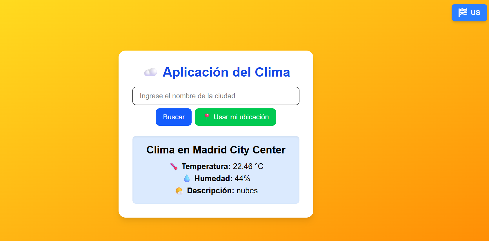
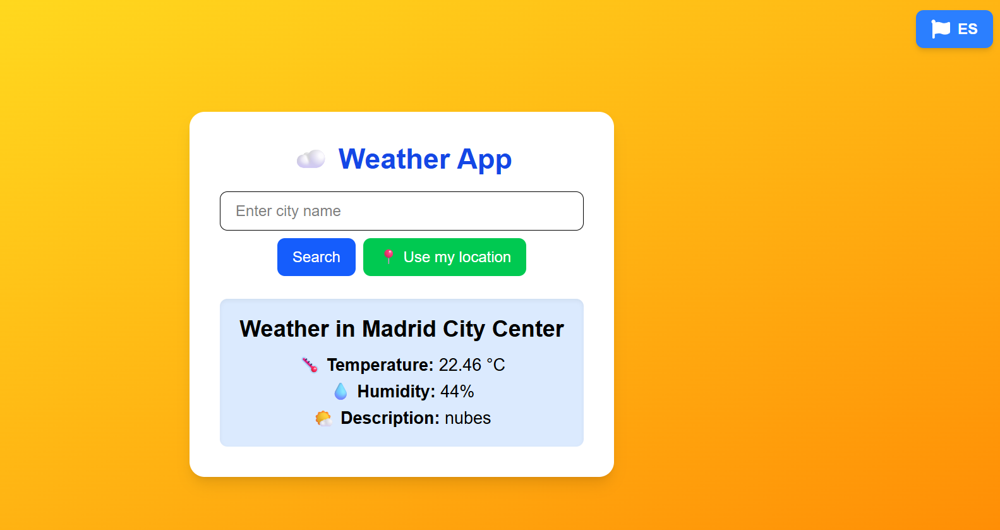

# Aplicación del Clima 🌤️

Esta es una aplicación web creada con React y Next.js que permite consultar el clima actual de cualquier ciudad, mostrando información como temperatura, humedad y descripción del clima. Además, el fondo cambia dinámicamente con un gradiente de colores según la temperatura y el tipo de clima (soleado, nublado, lluvia, etc.) y con un adicional de que se pueda escoger el idioma entre Es o Us.

---
## Screenshots App US / ES


---

## Características principales

- **Búsqueda de ciudades con autocompletado:** Mientras escribes, se muestran sugerencias de ciudades usando la API de geocodificación de OpenWeather.
- **Consulta del clima:** Obtiene datos en tiempo real desde la API de OpenWeather.
- **Detección de ubicación:** Puedes obtener el clima actual usando la geolocalización de tu navegador.
- **Fondo dinámico:** El fondo cambia con un gradiente de colores que refleja la temperatura y el tipo de clima.
- **Interfaz amigable y responsive:** Se adapta a dispositivos móviles y escritorio.

---

## Tecnologías usadas

- React con hooks (useState, useEffect)
- Next.js (React framework para SSR y rutas)
- TypeScript para tipado estático
- Axios para llamadas HTTP
- Tailwind CSS para estilos rápidos y responsivos
- API de OpenWeather para datos climáticos y geocodificación

---

## Instalación y ejecución local

1. Clona este repositorio:

```bash
git clone https://github.com/diegool2121/WeatherApp.git
```

2. Instala las dependencias:
```bash
npm install
```
3. Crea un archivo .env.local en la raíz del proyecto con tu API key de OpenWeather:
```bash
NEXT_PUBLIC_WEATHER_API_KEY=tu_api_key_aqui
NEXT_PUBLIC_WEATHER_API_BASE_URL=https://api.openweathermap.org
```
3. Ejecuta la aplicación en modo desarrollo:
```bash
npm run dev
```